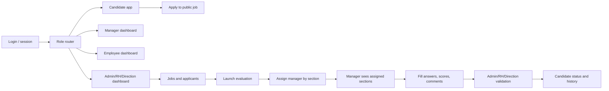

# FleetFlow Ideal Frontend Board

This document is the source blueprint for a new Figma page named **FleetFlow MVP Ideal Frontend**.

The direct Figma MCP write was blocked by the Starter plan tool-call limit, so this file describes the exact canvas to recreate/push once Figma access is available again.

## Product Intent

FleetFlow should feel like a professional operations application, not stretched mobile screens. The UI is mobile-first, then expands into compact desktop workspaces with side panels, split tables, and clear workflow steps.

## Visual System

- Background: `#10141b`
- Header: `#030816`
- Surface: `#1c2027`
- Elevated surface: `#232936`
- Border: `#3b4352`
- Primary action: `#1683f7`
- Primary soft: `#4a8eff`
- Text: `#f7f9ff`
- Muted text: `#aeb8ca`
- Success: `#25d07d`
- Warning: `#ffb082`
- Danger: `#ff6b7a`
- Focus ring: `2px solid #8ebcff`
- Font: Inter/system

Accessibility rules:

- Minimum AA contrast for all text and controls.
- Real buttons/links in implementation.
- Visible keyboard focus on every interactive element.
- Forms must include labels and field-level errors, especially `Champ obligatoire`.
- Error/success states never depend on color only.
- Dialogs and sheets need `role="dialog"`, `aria-modal`, focus trap, Escape close, and focus return.

## Canvas Layout

Create one Figma page: **FleetFlow MVP Ideal Frontend**.

Recommended top-level frames:

1. **00 - Workflow Map**
2. **01 - Login / Role Entry**
3. **02 - Admin Dashboard Desktop**
4. **03 - Tests Admin List**
5. **04 - Template Editor**
6. **05 - Pool And Question Manager**
7. **06 - Launch Evaluation**
8. **07 - Manager Queue**
9. **08 - Manager Questionnaire**
10. **09 - Admin Assessment Detail**
11. **10 - Candidate Public Jobs**
12. **11 - Candidate Dashboard**
13. **12 - Employee Dashboard**
14. **13 - Role Navigation Matrix**

## Workflow Map

## Role Navigation Matrix

| Role | Home | Main Menu | Forbidden UI |
| --- | --- | --- | --- |
| Admin | `/admin` | Dashboard, Contacts, Tests, Jobs, Roles | None, but dangerous actions require confirmation |
| Direction | `/direction` | Dashboard, Contacts, Tests, Jobs, Reporting | Role creation/deletion, destructive settings |
| RH | `/dashboard` | Dashboard, Contacts, Tests, Jobs | System roles |
| Manager | `/manager` | Home, Jobs, Tests, Profile | Global tests, templates, all candidates |
| Employee | `/employee` | Home, Tests, Profile | Applicants, templates, global scoring |
| Candidate | candidate app | Offers, Applications, Tests, Profile | Admin/employee app |

## Screens

### 01 - Login / Role Entry

Mobile and desktop centered, no scroll at common viewport heights. Logo, email/password fields, remember me, forgot password, CTA, request access, version footer.

Error states:

- Required fields: `Champ obligatoire`
- Invalid credentials: `Email ou mot de passe incorrect`
- Expired session: `Session expiree, reconnectez-vous`

### 02 - Admin Dashboard Desktop

Desktop layout:

- Header with product identity and session actions.
- Sidebar role-aware navigation.
- Compact KPI strip.
- Two main panels side-by-side, max 5 rows each:
  - Recent inflow
  - Tests requiring attention
- Secondary row:
  - Jobs needing action
  - Template health

No duplicated data. No huge cards. Scroll is allowed if content exceeds viewport.

### 03 - Tests Admin List

Shows all tests, not only completed:

- Search by candidate, job, template, manager.
- Filters: status, job, template, manager, date.
- Cards/table rows show candidate, job, template, progress, score, assigned managers, current status.
- Actions: View detail, validate, relaunch.

Empty state if API returns no evaluations.

### 04 - Template Editor

One vertical screen:

- General info: name, category, duration, difficulty, description.
- Sections with weight/points and manager instructions.
- Each section contains attached pools.
- Add section button.
- Add pool bottom sheet.
- Save blocked until each section has at least one pool and score total can scale to 100.

### 05 - Pool And Question Manager

Pool page/sheet:

- Manage pool button from add-pool sheet.
- Questions list with type badge.
- Add question editor.
- Question types:
  - Free text
  - Yes/No
  - True/False
  - Multiple choice, one or many correct answers
  - Rating/note
  - Practical rubric
- Required correct answer when applicable.
- Eliminatory toggle.
- Max points auto-fill and normalized to /100 at template/test level.
- Manager can override auto score with reason.

### 06 - Launch Evaluation

Dedicated screen from job applicant:

- Candidate and job context.
- Selected template summary.
- Section/module assignment cards.
- Every section requires a manager before launch.
- Clear messages:
  - `Champ obligatoire`
  - `Un test est deja en cours pour cette candidature`
  - `Le template est incomplet`

### 07 - Manager Queue

Manager sees only assigned sections/tests:

- Today/upcoming list.
- In-progress drafts.
- History link.
- Filters by status and job.
- No global tests.

### 08 - Manager Questionnaire

Evaluation form:

- Candidate/test header.
- Only assigned sections.
- Questions grouped by section/pool.
- Auto-score displayed when answer allows it.
- Score override control with reason.
- Per-question comment.
- Section comment.
- Global comment.
- Save draft and submit final.

### 09 - Admin Assessment Detail

Read/validation screen:

- Global score and status.
- Section scores.
- Every answer visible.
- Correct answers visible for admin/RH/direction.
- Auto score versus manager override.
- Eliminatory failures highlighted.
- Actions: Validate results, request retest, reopen if allowed.

### 10 - Candidate Public Jobs

Public:

- Job offers visible without login.
- Search and filters.
- Job detail public.
- Apply requires auth modal.

### 11 - Candidate Dashboard

Authenticated:

- My applications.
- Assigned tests.
- Status timeline.
- Empty states if API returns no data.

### 12 - Employee Dashboard

Authenticated:

- Profile summary.
- Assigned/internal tests.
- History.
- Empty state if no tests.

## Implementation Notes

- Use shared design primitives in `libs/shared`.
- No business placeholders in app screens. Figma examples are layout-only.
- Dashboard data comes from dashboard BFF endpoints.
- Route guards must match menu permissions.
- Frontend must keep Bearer JWT flow without `withCredentials`.
- Backend must scope manager/candidate/employee data server-side.

